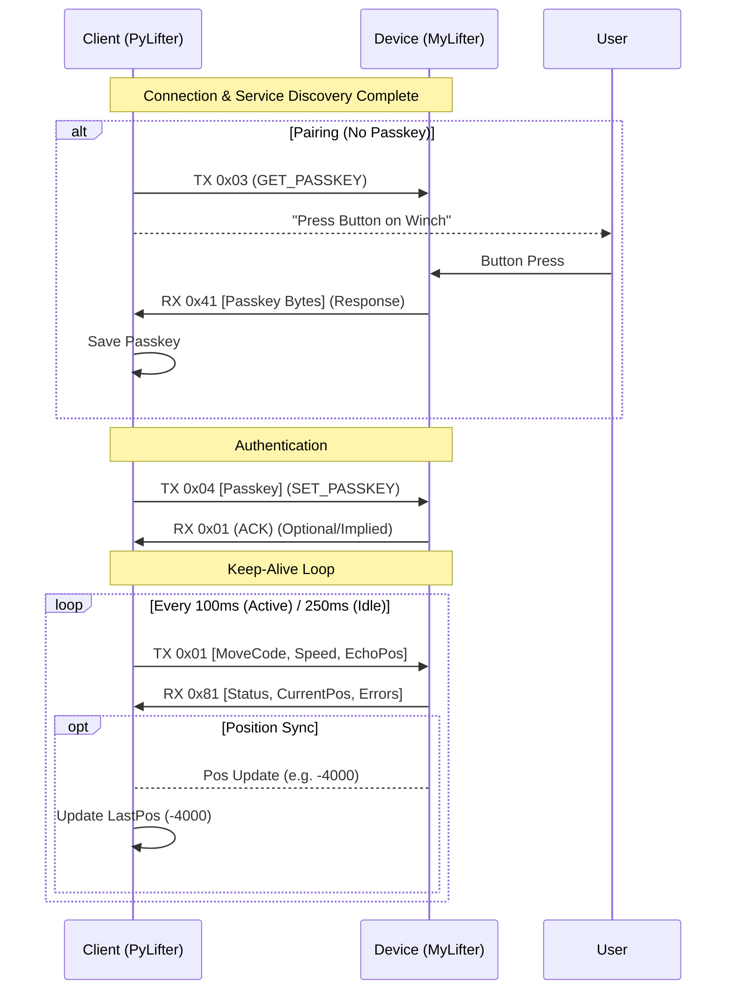

# MyLifter Bluetooth Protocol (Unofficial)

## Connection Details
- **Service UUID**: `2d88fb13-e261-4eb9-934b-5a4fea3e3b25`
- **Command Characteristic (Write)**: `A886C7EC-31EE-48D6-9AA8-35291B21780F`
- **Response Characteristic (Notify)**: `00EFF2B2-E420-4D23-9BDD-802AF59AEB6F`

## Connection & Authentication Flow
To control the winch, a "Secure Connection" session must be established.
1. Connect to BLE device.
2. Enable Notifications on Response Characteristic.
3. Send **Get Passkey** (`0x03` - Input Empty).
4. Receive **Get Passkey Response** containing the 6-byte passkey.
5. Send **Set Passkey** (`0x03` - Input 6-byte passkey).
6. Device is now ready for commands (Move, Get Status, etc).

## Packet Structure
All packets (Command and Response) follow this structure:
`[Command Code (1 byte)][Payload Length (1 byte)][Payload (N bytes)]`

Multi-byte integers are **Little Endian**.

## Command Codes

### ACK (`0x01`)
Generic Acknowledgement.
- **Payload**: `[Command Code being Acked (1 byte)]`

### NACK (`0x00`)
Generic Negative Acknowledgement.
- **Payload**: `[Command Code being Nacked (1 byte)] [Reason (1 byte?)]`

### Move (`0x23`)
Moves the winch.
- **Input**:
    - `move_code` (uint8): see `MoveCode` enum.
    - `speed` (uint8): 0-100 (percentage?)
    - `average_position_data` (int32): Usually 0? Usage needs verification.
- **Response**:
    - `length` (uint8)
    - `move_status` (uint8)
    - `error_code` (uint8)
    - `position` (int32): Current position (ticks?)
    - `weight` (uint16): Current weight load.

#### MoveCode Enum
| Name | Value | Description |
|---|---|---|
| Stop | 0 | Stop movement |
| Up | 1 | Move Up |
| Down | 2 | Move Down |
| SmartUp | 3 | Go to Top Set Point |
| SmartDown | 4 | Go to Bottom Set Point |
| MoveReference | 5 | Go to Reference Point? |
| StopError | 6 | Error State Stop |
| OverrideUp | 7 | Force Up (ignore limits?) |
| OverrideDown | 8 | Force Down (ignore limits?) |

### Get Status / Stats (`0x34`)
- **Input**: None (Payload Length 0)
- **Response**:
    - `total_cycles` (uint16)
    - `total_time` (uint32): Seconds?
    - `min_raw_temp` (uint16)
    - `max_raw_temp` (uint16)
    - `reset_count` (uint16)
    - `error_count` (uint16)
    - `error_classes` (uint32)

### Set Smart Point / Calibrate (`0x32`)
Sets a stop point.
- **Input**:
    - `calibration_code` (uint8): see `SmartPointCode` enum.

#### SmartPointCode Enum
| Name | Value | Description |
|---|---|---|
| Reference | 0 | Set Reference Point |
| Top | 1 | Set Top Stop (High Limit) |
| Bottom | 2 | Set Bottom Stop (Soft Limit) |

### Clear Smart Point (`0x33`)
Clears a stop point.
- **Input**:
    - `calibration_code` (uint8)

## Error Codes
Common error codes returned in the `error_code` field of the Move response:
- `0x00`: No Error
- `0x09`: Sync Error (Device position mismatch)
- `0x81`: Soft Limit Reached (Warning)
- `0x83`: Smart Point Not Set
- `0x86`: Hard Limit / End of Travel
Clears a stop point.
- **Input**:
    - `calibration_code` (uint8)

### Get Name (`0x8`)
- **Input**: `offset` (uint8)

### Set Name (`0x9`)
- **Input**: `name` (string, max 32 bytes)

### Get Passkey (`0x3`)
- **Input**: None

### Set Passkey (`0x3`)
- **Input**: `passkey` (6 bytes)
- **Command Code**: `0x03` (Same as Get, distinguished by payload length?)
  - *Note*: MyLifterSpec suggests both use `0x3`. `Get` has 0 input bytes. `Set` has 6 input bytes. The device likely distinguishes based on payload length/content.

### Get Version (`0x0A`)
- **Input**: None
- **Response**: 8+ bytes
    - Byte 0: HW Minor
    - Byte 1: HW Major
    - Byte 2: HW Version
    - ...
    - Byte 6: **Firmware Minor**
    - Byte 7: **Firmware Major**
    - (e.g., Bytes 7,6 = `3, 2` -> v3.2)

### Get Protocol Version (`0x05`)
- **Input**: None
- **Response**: 1 byte
    - Nibble encoded: `0x41` -> `4.1`

## Protocol JSON Spec
Extracted from `MyLifterSpec.java`:
```json
{
  "devices": {
    "my_lifter": {
      "service": "2d88fb13-e261-4eb9-934b-5a4fea3e3b25",
      "response_uuid": "00EFF2B2-E420-4D23-9BDD-802AF59AEB6F",
      "dfu_service": "56d5862a-0899-4eeb-a5a7-af43c5ccf11e",
      "commands": {
        "move": {
          "command_code": "0x23",
          "input": [
             {"keypath": "move_code", "type": "uint-little-8"},
             {"keypath": "speed", "type": "uint-little-8"},
             {"keypath": "average_position_data", "type": "int-little-32"}
          ]
        },
        ...
      }
    }
  }
}
```

## Protocol Flow

### Pairing & Connection Handshake



### Key Behaviors
1.  **Robust Echo**: The client **must** echo the device's last reported position in every Keep-Alive packet. Sending `0` when the device is at `-5000` causes a **Sync Error (0x09)**.
2.  **Timing & Throttling**:
    *   **Idle Rate**: Send Keep-Alive packets at ~4Hz (250ms) when idle to maintain connection without saturating the stack.
    *   **Active Rate**: Send at ~10Hz (100ms) during movement for responsiveness.
    *   **Throttling**: A delay of ~20ms is recommended after *every* write operation to prevent "InProgress" errors from the Bluetooth stack, especially during high-traffic phases like startup.
3.  **Pairing**: The device will not send the Passkey until `GET_PASSKEY` is received AND the physical button is pressed.
3.  **Passkey Persistence**: Once retrieved, the Passkey is permanent and should be stored to avoid requiring physical button presses for future connections.
